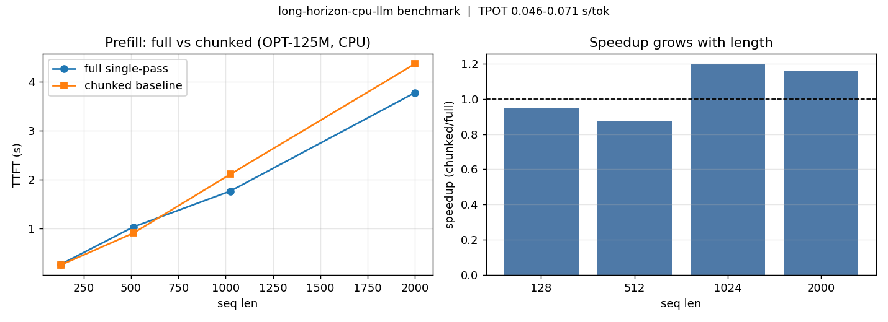

# CPU-LLM-Inference — long-horizon inference on CPUs

Python prototype for long-horizon CPU inference:
**"trade storage for computation"** — use CPU DDR capacity to beat GPU HBM on long-horizon inference.

## Core design
- **Full single-pass Prefill** — no chunking, params loaded once (`CPUEngine.prefill_full`)
- **Incremental Prefill / Session Cache** — keep KV across turns, forward only new tokens (`CPUEngine.generate` + prefix reuse)
- **Static-shape non-paged KV** — preallocated `[max_seq, H_kv, D]`, seq-dim first (`StaticKVCache`)
- **Small-batch Decode** — batch=1, more bandwidth per request
- **Head-by-head attention** — CPU-cache-friendly SDPA (`attention_head_by_head`)

## Features
1. **OpenAI / vLLM-compatible server** — `/v1/chat/completions` (streaming), `/v1/completions`, `/v1/rag/chat`, `/metrics`
2. **Quant + dtype** — dynamic INT8 (`CPU_LLM_INT8=1`), fp16/bf16, KV memory estimator
3. **Long-horizon memory** — persistent JSONL sessions, RAG injection helper
4. **Benchmark + HTML dashboard** — full vs chunked TTFT, TPOT, speedup table
5. **Multi-model** — opt-125m, TinyLlama-1.1B, Qwen2.5-0.5B, Qwen3-0.6B/30B, Phi-3-mini, Llama-3.2-1B, Mistral-7B

## Quickstart (Windows CPU OK)
```powershell
pip install -r requirements.txt
# 1) local chat, no server (downloads ~250MB tiny model on first run)
python scripts/local_chat.py --model tiny-opt-125m
# 2) API server
python scripts/run_server.py
python scripts/chat.py
# 3) benchmark full vs chunked
python -m src.bench.benchmark --model tiny-opt-125m --lengths 128,512,1024,2000 --max-new 8
# 4) tests (no download)
pytest tests/ -v
# 5) 50K long-context test (A+B no model, C capped to model max)
python scripts/long_context_test.py --seq-len 1024 --skip-model
python scripts/long_context_test.py --model tiny-opt-125m --seq-len 2048
# 6) GGUF quantized backend (optional)
pip install llama-cpp-python
python scripts/run_gguf.py --model path/to/qwen2.5-0.5b-instruct-q4_k_m.gguf --n-ctx 8192
# 7) Streamlit dashboard
streamlit run dashboard/app.py
```

Env: `CPU_LLM_MODEL=tinyllama-1.1b CPU_LLM_MAX_SEQ=8192 CPU_LLM_INT8=1 python scripts/run_server.py`

## Benchmark results (OPT-125M, Windows CPU, real run)

Full single-pass prefill vs chunked baseline (`chunk=512`, `max_new=8`).
Chunking wins at tiny lengths; full-pass wins once the prompt gets long
(no repeated parameter loading).

| seq_len | TTFT full (s) | TTFT chunked (s) | speedup | TPOT (s/tok) |
|---------|---------------|------------------|---------|--------------|
| 128     | 0.2624        | 0.2490           | 0.95x   | 0.0568       |
| 512     | 1.0271        | 0.9011           | 0.88x   | 0.0462       |
| 1024    | 1.7595        | 2.1039           | 1.20x   | 0.0599       |
| 2000    | 3.7719        | 4.3619           | 1.16x   | 0.0709       |

Reproduce: `python -m src.bench.benchmark --model tiny-opt-125m --lengths 128,512,1024,2000 --max-new 8`



## Dashboard

`streamlit run dashboard/app.py` — three tabs:

- **Chat (session cache)** — multi-turn chat with TTFT/TPOT + reused-token stats
- **Benchmark** — reruns the table/chart above live on your box
- **Long-context memory** — DDR sizer + one-click 50K static-cache check


## Layout
```
src/engine/kv_cache.py    static KV, dimension-first
src/engine/attention.py   head-by-head vs batched
src/engine/inference.py   CPUEngine: full/incremental prefill + decode
src/engine/quant.py       INT8 + memory estimates
src/engine/model_loader.py registry (Qwen/Llama/Mistral/Phi/OPT)
src/server/app.py         FastAPI OpenAI-compatible (HF + GGUF via CPU_LLM_MODEL=.gguf)
src/memory/session_store.py persistence + RAG
src/bench/benchmark.py    TTFT/TPOT + HTML report
src/engine/backends.py    HFBackend + LlamaCppBackend factory
scripts/long_context_test.py  50K 3-phase test (static + attention + model)
scripts/run_gguf.py       GGUF chat
dashboard/app.py          Streamlit: chat, bench, memory
```

## Notes on scaling
- For 50K-token single-pass on 30B models you need a big Linux CPU box
  This is a **correct, runnable Python mirror** of its ideas on small models.
  For 30B: use `qwen3-coder-30b` model id on a big Linux CPU box with `--max-seq 50000`.
- Correctness first: uses HF `DynamicCache` for logits; `StaticKVCache` mirrors accounting.
  Swap in `attention_head_by_head` as a drop-in kernel experiment (see tests).
